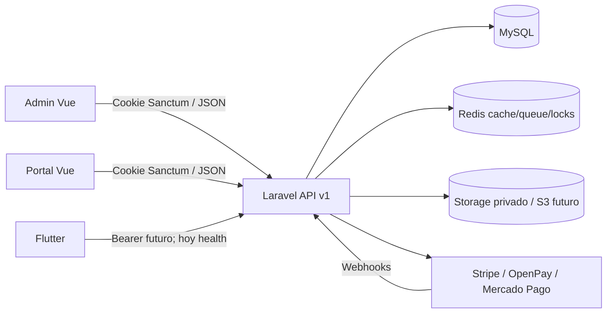
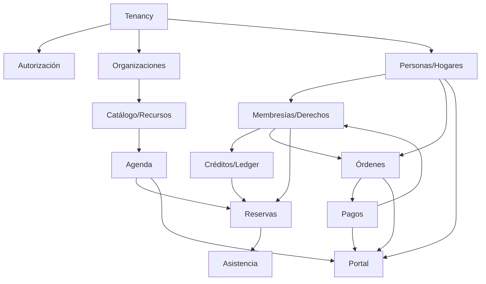
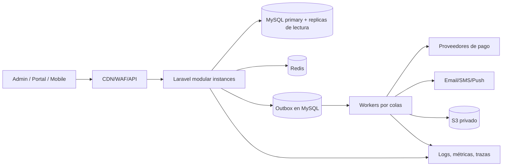

# Arquitectura

## Vista actual

TurnoUno es un monorepo con cuatro aplicaciones y documentación de producto/arquitectura:

```text
apps/
├── api/          Laravel 13 / PHP 8.3 / MySQL / Redis
├── admin-web/    Vue 3 / TypeScript / Vite / Pinia / Tailwind
├── portal-web/   Vue 3 / TypeScript / Vite / Pinia / Tailwind
└── mobile/       Flutter / Riverpod / Dio
docs/             ADR, dominio, API, seguridad y planes
```

La API usa un **monolito modular**. Cada módulo agrupa aplicación, modelos, HTTP, excepciones y enums bajo `apps/api/app/Modules`. El patrón es razonable para el tamaño actual: preserva transacciones locales y reduce complejidad operativa.



## Flujo de una solicitud tenant-scoped

1. Sanctum autentica cookie o bearer token.
2. `ResolveTenantContext` toma `X-Tenant-ID`; si falta y existe una sola pertenencia activa, la selecciona automáticamente.
3. El middleware verifica la pertenencia activa, instala `TenantContext` y el team de Spatie.
4. `RequireTenantContext` rechaza operaciones de dominio sin tenant.
5. `BelongsToTenant` agrega el filtro global y fuerza `tenant_id` al crear.
6. Los controladores aplican permisos con `Gate`.

Esta cadena es una buena defensa por capas, pero tiene tres fisuras:

- no comprueba que el tenant mismo esté activo/suspendido (`ResolveTenantContext.php:42-72`);
- las SPA no envían `X-Tenant-ID`, por lo que usuarios con dos tenants quedan bloqueados;
- el scope por sucursal se implementó en `ControlDeAcceso`, pero los endpoints de agenda/asistencia/roster no lo invocan.

## Dependencias entre dominios



El grafo contiene ciclos conceptuales válidos, pero la implementación los resuelve con llamadas sincrónicas directas. El caso más sensible es `Pagos → Membresías/Créditos`: un pago aprobado crea acuerdos y movimientos en la misma transacción. Para pago manual local puede ser apropiado; para proveedores remotos no, porque la red no comparte la transacción de MySQL.

## Evaluación de componentes

| Componente | Acierto | Riesgo principal | Evolución recomendada |
|---|---|---|---|
| API Laravel | Convenciones claras, Form Requests, enums, ULID | Procesos inter-módulo sin orquestador durable | Servicios de aplicación explícitos + outbox para efectos asíncronos |
| MySQL | Fuente única, FKs, ledger | Tenant coherente no garantizado por FK compuesta; cascadas históricas | Invariantes compuestas, checks y política de retención |
| Redis | Preparado para cache/colas | Pocos jobs reales; trabajo pesado sigue sincrónico | Colas por prioridad, retries controlados, métricas y DLQ |
| Admin/portal | Separación por audiencia, lazy routes | Duplicación de cliente/auth y vistas monolíticas | Paquete compartido de API/contratos y componentes de flujo |
| Flutter | Stack moderno | Solo health; sin autenticación ni dominio | Tratarlo como producto nuevo, no como “casi listo” |
| Pagos | Adaptadores por proveedor | Red dentro de DB transaction, reembolso ficticio | Payment orchestrator, idempotencia PSP, conciliación |
| Observabilidad | Correlation ID | Sin métricas/trazas/audit log | Logs estructurados, OpenTelemetry/Sentry, métricas de negocio |

## Patrones correctos a conservar

### Monolito modular

No se recomienda separar microservicios ahora. La organización actual reduce latencia y permite transacciones de reservas/ledger. Antes de una extracción se necesitan límites internos verificables, telemetría y un volumen que justifique el costo.

### Ledger de créditos

Derivar saldo de movimientos evita inconsistencias de un campo mutable. El problema no es el patrón, sino su lectura N+1 y la falta de liquidación automática de holds. Conviene conservar el ledger y añadir agregación eficiente, referencias de negocio únicas y reconciliación.

### Multi-tenancy shared-schema

Es una elección eficiente para la etapa actual. Debe reforzarse con:

- claves/índices compuestos y validación de relaciones dentro del mismo tenant;
- pruebas de aislamiento para cada ruta nueva;
- estado operativo del tenant (`active`, `suspended`, `closed`) aplicado centralmente;
- namespaces por tenant en cache, objetos, jobs y exportaciones;
- herramientas de exportación/borrado/retención por tenant.

## Flujos críticos y fronteras transaccionales

### Reserva

`sesión + persona + derecho → lock sesión → validar → hold → reserva` está dentro de una transacción y protege la capacidad. Falta cerrar el flujo posterior: asistencia/no-show/cancelación de sesión debe liquidar o liberar el hold exactamente una vez.

### Compra y pago

La creación de orden congela precios correctamente. El cobro actual crea `Pago`, llama al proveedor y hace fulfillment dentro de una transacción (`CobrarOrden.php:42-89`). La frontera correcta es:

1. transacción corta: crear intento `initiated` y outbox;
2. llamada remota con clave idempotente estable;
3. transacción corta: persistir referencia/estado;
4. webhook o conciliador registra el evento único y aprueba;
5. fulfillment idempotente y auditable.

### Reembolso

Debe modelarse como una operación propia (`refund_requested → processing → succeeded/failed`), vinculada al proveedor y con monto. Solo después de confirmación externa se revierte el derecho; si la reversión interna falla, un worker de reparación completa la saga.

## Decisiones recomendadas

1. Mantener el monolito modular durante los próximos 12 meses.
2. Añadir un módulo `Audit` transversal y un `Outbox` técnico antes de incorporar notificaciones o más pasarelas.
3. Convertir pagos y reembolsos en máquinas de estados, sin llamadas de red bajo locks de DB.
4. Establecer un servicio único de autorización contextual que reciba tenant, sucursal y recurso.
5. Crear un ciclo de vida único para sesión/reserva/hold/asistencia.
6. Publicar contratos OpenAPI generados y tipos compartidos para evitar deriva frontend/backend.
7. Introducir módulos separados solo cuando haya necesidad operativa demostrada; candidatos futuros serían notificaciones y reporting, no reservas/pagos inicialmente.

## Objetivo de arquitectura a 6–12 meses



Esta evolución mantiene una única fuente transaccional, mueve efectos externos fuera de locks y permite reintentos observables sin introducir coordinación distribuida innecesaria.
