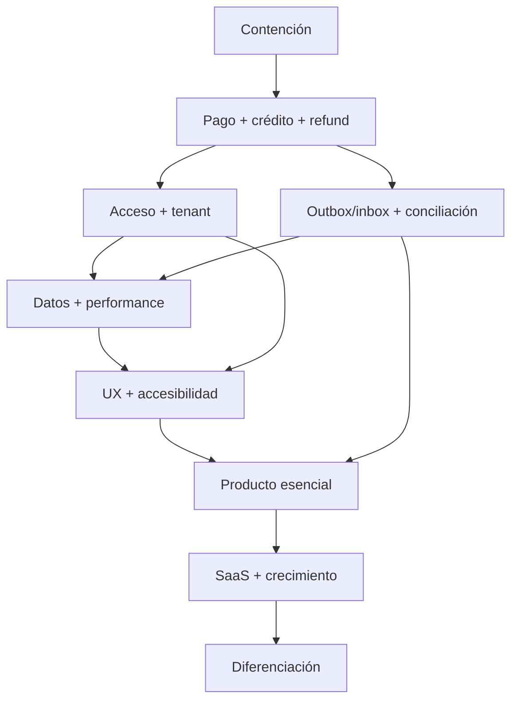

# Roadmap recomendado

## Reglas del plan

- El roadmap parte de una congelación temporal de nuevas funciones financieras.
- Cada ítem crítico incluye prueba de regresión, telemetría y rollback.
- Las semanas son rangos orientativos para un equipo pequeño de 3–5 ingenieros más producto/QA; deben recalibrarse.
- No se inicia una fase si sus *gates* de seguridad/integridad no pasan.

## Fase 0 — Contención inmediata (día 0–2)

| Acción | Dueño sugerido | Resultado verificable |
|---|---|---|
| Deshabilitar `manual` y `simulada` en portal/producción | Backend | Request miembro retorna 422/403; adaptador simulado no está registrado en prod |
| Bloquear despliegues con seeders demo | Backend/DevOps | Seeder demo aborta en prod; pipeline detecta cuentas `.test` |
| Deshabilitar reembolso online o etiquetarlo como no disponible | Producto/Backend | Nadie puede marcar “reembolsado” sin PSP |
| Revisar si hubo pagos/derechos/holds afectados | Operaciones | Reporte de órdenes manual/simulada, refunds y holds pasados |
| Rotar credenciales si seeders tocaron un entorno expuesto | Seguridad/Operaciones | Evidencia de rotación/revocación |

**Gate:** entorno productivo no ofrece bypass; incident review completado.

## Fase 1 — Corrección P0 y pruebas (semana 1–2)

### Stream A: pago seguro

- Separar métodos por canal/entorno.
- Crear intentos idempotentes con request hash.
- Añadir idempotency key a llamadas PSP.
- Definir timeouts y errores seguros.
- Pruebas: doble click, misma clave/payload distinto, PSP timeout, commit failure simulado.

### Stream B: créditos y asistencia

- Definir state machine de reserva/hold/asistencia/no-show.
- Confirmar/liberar/perder hold exactamente una vez.
- Cancelación de sesión en transacción/lotes, sin promoción.
- Job reconciliador de holds huérfanos.
- Pruebas concurrentes y de re-marcado.

### Stream C: reembolso

- Entidad/estados de refund.
- Adaptador PSP real por proveedor.
- Reversión de beneficio originado por línea, no saldo total.
- Motivo, actor, referencia y estado de fallo.
- Deshabilitar proveedor sin capacidad de refund o workflow manual explícito.

**Gate:** 0 P0 abiertos; suite negativa/concurrencia verde; conciliación no muestra discrepancias en dataset de prueba.

## Fase 2 — Seguridad de acceso y tenant (semana 3–4)

- Policies contextuales por recurso/sucursal.
- Instructor limitado a sesiones asignadas; minimización de roster.
- Selector tenant en admin/portal e interceptor `X-Tenant-ID`.
- Estado del tenant aplicado a request/job.
- Rate limiting login/token/webhooks/health.
- Expiración/abilities/dispositivos para tokens.
- Recuperación/cambio de contraseña, invitaciones y verificación; MFA para owner/finanzas.
- Limpiar `TenantContext` y `PermissionRegistrar` en `finally` de workers.
- Secret scanning y configuración productiva obligatoria.

**Gate:** matriz automatizada rol×tenant×sucursal×sesión; tenant suspendido no muta; usuario multi-tenant completa flujo E2E.

## Fase 3 — Consistencia financiera durable (semana 4–7)

- Outbox e inbox de webhooks.
- Event ID único, timestamp/replay window y validación monto/moneda/merchant.
- Máquina de estados de pago/orden/fulfillment.
- Resolver múltiples intentos y eventos fuera de orden.
- Conciliador PSP y panel de discrepancias.
- Audit log append-only para pagos, créditos, pasarelas, asistencia y permisos.
- Alertas: pending envejecido, pago aprobado sin fulfillment, refund divergente.

**Gate:** chaos tests de duplicado, orden invertido, caída de PSP/worker/DB; toda divergencia termina resuelta o alertada.

## Fase 4 — Datos y rendimiento base (semana 6–9)

- Cursor pagination y límites en todos los endpoints de lista.
- Eliminar N+1 del ledger con agregados de query.
- Trocear generación de ciclos; filtrar tenant/acuerdo activo e indexar fecha.
- Validar moneda, items, cantidades e importes.
- Estados publicable/archivado para productos/catálogos.
- Constraints/checks y FK tenant compuestas prioritarias con migración expand-contract.
- Cambiar cascadas financieras por retención/archivo.
- Query budgets y slow query telemetry.

**Gate:** dataset de escala pasa SLO inicial; 0 endpoints públicos sin límite; verificador no encuentra relación cross-tenant.

## Fase 5 — UX operacional y accesibilidad (semana 8–11)

- Navegación admin/portal responsive.
- Patrón común loading/empty/error/401/403/409/422/429.
- Confirmación y motivo para acciones sensibles.
- Touch targets, teclado, foco, live regions, contraste y dialogs accesibles.
- Descomponer hotspots de Agenda/Membresías/Catálogo.
- `packages/web-core` para API/auth/tenant/errors; armonizar Pinia/Router.
- E2E críticos, axe y regresión de breakpoints.

**Gate:** WCAG 2.2 AA para flujos prioritarios; E2E en 375 px y escritorio; cero pérdida de intención ante reautenticación/retry.

## Fase 6 — Producto esencial (semana 10–14)

- Portal familiar/dependientes.
- Motor de políticas de cancelación/no-show/costo/ventanas.
- Notificaciones con preferencias, outbox y deep links.
- Waitlist robusta con revalidación y aceptación.
- Check-in instructor seguro.
- Reportes operativos/financieros básicos desde proyecciones.

**Gate:** pilotos de pole/natación/gym completan journeys propios sin bypass administrativo y con trazabilidad.

## Fase 7 — SaaS y crecimiento (mes 4–6)

- Tenant lifecycle, trial, planes, límites y metering.
- Facturación de TurnoUno y control de morosidad del tenant.
- Branding/dominio/config regional y feature flags.
- S3 privado, AV, retención y exportación por tenant.
- Suscripciones de miembros/dunning sobre payment core estable.
- Booking público/widget y campañas/referrals.
- App móvil miembro MVP; modo instructor después.

**Gate:** alta/suspensión/cierre ejercitados; restore y export tenant probados; unit economics/uso medibles.

## Fase 8 — Diferenciación (mes 6–12)

- Analítica de ocupación/retención y playbooks CRM.
- Sugeridor de horarios/recursos explicable.
- Plantillas verticales versionadas.
- API/webhooks para integraciones e identidad empresarial según demanda.
- Warehouse y experimentación controlada.

## Dependencias principales

## Backlog técnico por prioridad

### P0

- F-01 pago gratuito.
- F-02 liquidación de hold.
- F-03 reembolso real.
- SEC-02 seeders demo.

### P1

- Orquestación/idempotencia/conciliación de pagos.
- Cancelación de sesión completa.
- Policies de sucursal/instructor.
- Rate limit/tokens/tenant status/selector.
- Conflictos de recursos/staff.
- Lista de espera y elegibilidad.
- Auditoría/outbox/observabilidad.
- Paginación/N+1/job de ciclos.
- Integridad tenant y límites financieros.

### P2

- Portal familiar.
- UX responsive/a11y y refactor frontend.
- Estados publicables/archivado.
- Storage/AV/retención.
- Documentación/CI supply-chain.
- Mobile MVP.

### P3

- Reporting avanzado, control plane completo, booking público, CRM y sugeridor.

## Definición de terminado para flujos críticos

Un cambio está terminado cuando:

1. la invariante está escrita y aplicada en servidor;
2. la base la refuerza cuando es viable;
3. hay pruebas happy, negative, retry y concurrency relevantes;
4. la UI muestra estados/errores accesibles;
5. audit y métricas permiten observarlo;
6. existen runbook y rollback;
7. documentación/contrato se actualizan;
8. seguridad/producto/operaciones aceptan el resultado.

## Ritmo y gobernanza

- Revisión semanal de P0/P1, discrepancias y métricas.
- Threat modeling ligero para todo flujo financiero o con PII.
- ADR para cambios de state machine/invariantes.
- 25–35% de capacidad para deuda hasta cerrar P1.
- Release gradual por tenant con feature flags.
- Postmortem sin culpa para toda discrepancia de dinero, derecho o tenant.
